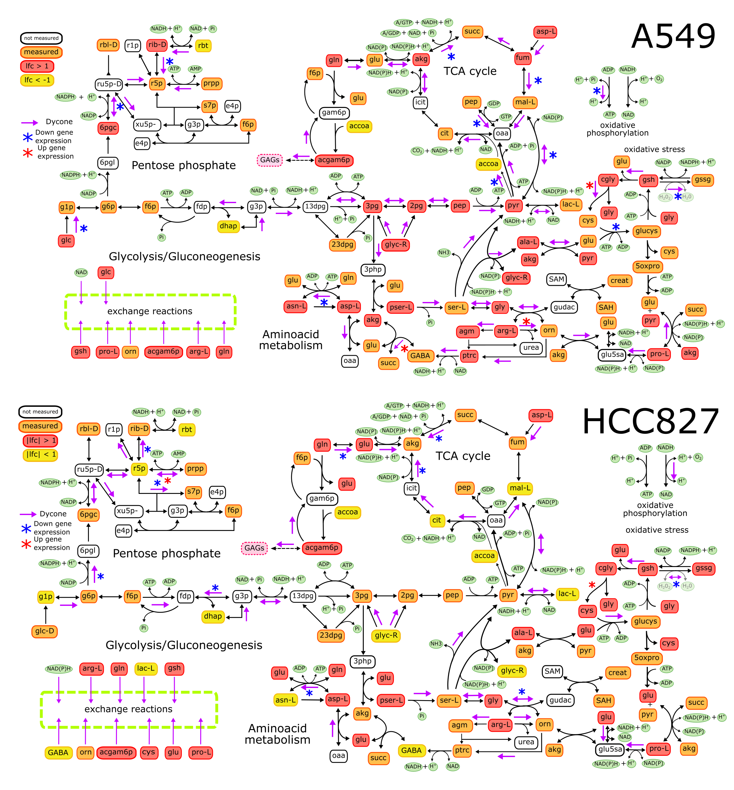

```{r setup, include=FALSE}
knitr::opts_chunk$set(echo = TRUE)
```

## Data

This is a protocol to analyze Metabolomic data from [Sun Y., *et. al.* 2014](https://doi.org/10.1186/2049-3002-2-20) to infer reactions changing after EMT induction with TGF-$\beta$. We analyzed the data from the three cell lines: A549, HCC827, NCI-H358. 

## Metabolomic analysis 

The tables contain name, BIGG, HMDB, KEGG ids, and concentrations of several metabolites measured in LC-MS and GC-MS. 

```{r, echo=FALSE}
EMT<-read.delim("input/Metabolomica_antes-despues_EMT.txt")
EMT<-EMT[1:387,]

A549<-EMT[,c(1,9:10,11:20)]
HCC827<-EMT[,c(1,9:10,21:30)]
H358<-EMT[,c(1,9:10,31:40)]
```

```{r}
head(A549)
```

Hence, we calculated the fold change and compare using a paired t test. We considered a significant value when *p*-value less than .05 and log fold change absolute value above 1.
The same process was done for the three cell lines. 

```{r}
Parental<-grep("Parental",colnames(A549))
Mesenchymal<-grep("Mesenchymal",colnames(A549))

apply(A549[,Parental],1,mean)->concmetepi
apply(A549[,Mesenchymal],1,mean)->concmetmes


for(i in 1:length(rownames(A549))){
  t.test(as.numeric(A549[i,Parental]),as.numeric(A549[i,Mesenchymal]),paired = T)->test
  test$p.value->A549$pvalue[i]
}
p.adjust(A549$pvalue,method = "fdr")->A549$pvalue

A549$foldchange<-log2(concmetmes/concmetepi)

head(A549[,c(1,14:15)])

```


```{r, echo=FALSE}
apply(HCC827[,Parental],1,mean)->concmetepi
apply(HCC827[,Mesenchymal],1,mean)->concmetmes

for(i in 1:length(rownames(HCC827))){
  t.test(as.numeric(HCC827[i,Parental]),as.numeric(HCC827[i,Mesenchymal]),paired = T)->test
  test$p.value->HCC827$pvalue[i]
}
p.adjust(HCC827$pvalue,method = "fdr")->HCC827$pvalue

HCC827$foldchange<-log2(concmetmes/concmetepi)


apply(H358[,Parental],1,mean)->concmetepi
apply(H358[,Mesenchymal],1,mean)->concmetmes

for(i in 1:length(rownames(H358))){
  t.test(as.numeric(H358[i,Parental]),as.numeric(H358[i,Mesenchymal]),paired = T)->test
  test$p.value->H358$pvalue[i]
}
p.adjust(H358$pvalue,method = "fdr")->H358$pvalue

H358$foldchange<-log2(concmetmes/concmetepi)

A549$pvalue[is.na(A549$pvalue)]<-1
A549$threshold <- 0
A549$threshold[which(abs(A549$foldchange)>1 & A549$pvalue<.05)] <- 1
A549$threshold <- as.factor(A549$threshold)

HCC827$pvalue[is.na(HCC827$pvalue)]<-1
HCC827$threshold <- 0
HCC827$threshold[which(abs(HCC827$foldchange)>1 & HCC827$pvalue<.05)] <- 1
HCC827$threshold <- as.factor(HCC827$threshold)

H358$pvalue[is.na(H358$pvalue)]<-1
H358$threshold <- 0
H358$threshold[which(abs(H358$foldchange)>1 & H358$pvalue<.05)] <- 1
H358$threshold <- as.factor(H358$threshold)


```

And finally we got these graphs:

```{r,echo=FALSE,warning=FALSE}

library(ggplot2)

ggplot(A549,aes(x=foldchange, y=-log10(pvalue), colour=threshold)) +
  geom_point(size=3) +
  ggtitle(label = "A549")+
  xlab("log2 fold change") + 
  ylab("-log10 p-value") +
  theme(text = element_text(size=25),legend.position="none",
        plot.title = element_text(hjust = 0.5))+
  #geom_text_repel(aes(label=A549$labels))+
  scale_color_brewer(palette="Set1")+#xlim(c(-2,2.2))+
  geom_hline(yintercept = -log(0.05,10), linetype = "dashed",color="red") +
  geom_vline(xintercept = c(-1, 1), linetype = "dashed",color="red") +
  xlim(-6,6)+ylim(0,4)

ggplot(HCC827,aes(x=foldchange, y=-log10(pvalue), colour=threshold)) +
  geom_point(size=3) +
  ggtitle(label = "HCC827")+
  xlab("log2 fold change") + 
  ylab("-log10 p-value") +
  theme(text = element_text(size=25),legend.position="none",
        plot.title = element_text(hjust = 0.5))+
  #geom_text_repel(aes(label=A549$labels))+
  scale_color_brewer(palette="Set1")+#xlim(c(-2,2.2))+
  geom_hline(yintercept = -log(0.05,10), linetype = "dashed",color="red") +
  geom_vline(xintercept = c(-1, 1), linetype = "dashed",color="red") +
  xlim(-6,6)+ylim(0,4)

ggplot(H358,aes(x=foldchange, y=-log10(pvalue), colour=threshold)) +
  geom_point(size=3) +
  ggtitle(label = "NCI-H358")+
  xlab("log2 fold change") + 
  ylab("-log10 p-value") +
  theme(text = element_text(size=25),legend.position="none",
        plot.title = element_text(hjust = 0.5))+
  #geom_text_repel(aes(label=A549$labels))+
  scale_color_brewer(palette="Set1")+#xlim(c(-2,2.2))+
  geom_hline(yintercept = -log(0.05,10), linetype = "dashed",color="red") +
  geom_vline(xintercept = c(-1, 1), linetype = "dashed",color="red") +
  xlim(-6,6)+ylim(0,4)


```

In summary, if we compare the three cell lines we got that, after EMT, only 6 metabolites changed in common for all the NSCLC cell lines.


```{r,echo=FALSE}
A549$BIOCHEMICAL[which(A549$threshold==1)]->a
HCC827$BIOCHEMICAL[which(HCC827$threshold==1)]->b
H358$BIOCHEMICAL[which(H358$threshold==1)]->c

Matrix<-matrix(0,nrow=length(rownames(A549)),ncol=3)
rownames(Matrix)<-A549$BIOCHEMICAL
colnames(Matrix)<-c("A549","HCC827","NCI358")
Matrix[which(rownames(Matrix) %in% a),1]<-1
Matrix[which(rownames(Matrix) %in% b),2]<-1
Matrix[which(rownames(Matrix) %in% c),3]<-1

library("limma")
vennCounts(Matrix)->conteo
vennDiagram(conteo,circle.col = c("red","blue","green"))

as.data.frame(Matrix)->Todo
rownames(Todo[which(Todo$A549==1&Todo$HCC827==1&Todo$NCI358==1),])
```


## Dycone analysis

Then, we introduce the data to [Dycone](https://github.com/cdiener/dycone) algorithm. In summary, this algorithm will predict which reactions are changing among two conditions, in this case before and after EMT, using the [k-cone](https://github.com/cdiener/kcone-paper) approach.

```{r,echo=FALSE}
A549<- read.csv("input/metabolomeA549.csv")
HCC827<-read.csv("input/metabolomeHCC827.csv")
H358<-read.csv("input/metabolomeNCIH358.csv")
```

We start with a reconstruction and the table of the metabolites with KEGG and HMDB ids. Dycone has special functions to convert bidirectional reactions in two irreversible reactions. As in original paper we imputed missing data from [Human Metabolome Database](https://hmdb.ca/metabolites) to complete the concentration table. Then we applied k-cone analysis to predict which reactions are changing after EMT. This same process was done for the three cell lines. 

```{r, warning=FALSE}
library(dycone)

r <- read_reactions("input/reactions.csv")
id_map <- read.csv("input/id_map_RXNS.csv", stringsAsFactors=FALSE)

metab <- read.csv("input/metabolomeA549.csv")

library(tidyr)
library(ggplot2)

#############################################
#Imputation of missing data

#### ID map must haveonly one HMDB id per metabolite

matches <- sapply(id_map$kegg, grep_id, x = metab$kegg_id)
miss <- is.na(matches)

full <- id_map[, 1:2]
d_idx <- 5:14
m <- matrix(NA, nrow = nrow(full), ncol = length(d_idx))
colnames(m) <- names(metab)[d_idx]
full <- cbind(full, m)
matched_idx <- !is.na(matches)
full[matched_idx, 3:12] <- metab[matches[matched_idx], d_idx]

{
  concs <- hmdb_concentration(id_map$hmdb, add = id_map[, 1:2])
} %c% "output/scraped_concs.Rd"


m_concs <- as.vector(by(concs, concs$name, priority_mean))
names(m_concs) <- levels(factor(concs$name))


scraped <- data.frame(kegg = names(m_concs), normal = m_concs)
rownames(scraped) <- NULL
patched <- patch(full, id = 1, normal = 3:7, treatment = 8:12, ref_data = scraped)
patched[is.na(patched)]<-1
head(patched)

###########################################
####k-cone analysis
S <- stoichiometry(r)

mats <- ma_terms(S, patched[, c(1, 3:12)])

samples <- rep(c("normal", "disease"), each = 5)

h<-hyp(r,samples,mats,full=T)

pw <- rp(make_irreversible(r), "pathway")[,2]
r_ids <- rp(make_irreversible(r), "KEGG_reaction")[,2]

h$hyp <- cbind(h$hyp, pathway = pw[h$hyp$idx])
h$hyp <- cbind(h$hyp, reaction_id = r_ids[h$hyp$idx])

###Save all results
#write.csv(h$hyp, file = "A549reactions.csv", quote = F, row.names = F,sep="\t")

#Number of reactions with significannt changes after EMT 
length(which(h$hyp$corr_pval<.05 & abs(h$hyp$k_lfc)>1))

FINAL<-h$hyp[which(h$hyp$corr_pval<.05 & abs(h$hyp$k_lfc)>1),]

write.csv(FINAL,file="output/DyconeA549.csv",quote=F,row.names=F)

```

In the following image we represented the reactions altered according to dycone analysis, besides changes in the expression of genes coding these metabolic enzymes. We represented the results of dycone analysis with purple arrows over the reactions. Also, asteriks represent gene expression alteration of the enzymes that catalyzes these reactions.





```{r, echo=FALSE,warning=FALSE}
#### HCC827

metab <- read.csv("input/metabolomeHCC827.csv")

#############################################
#Imputation of missing data

#### ID map must haveonly one HMDB id per metabolite

matches <- sapply(id_map$kegg, grep_id, x = metab$kegg_id)
miss <- is.na(matches)

full <- id_map[, 1:2]
d_idx <- 5:14
m <- matrix(NA, nrow = nrow(full), ncol = length(d_idx))
colnames(m) <- names(metab)[d_idx]
full <- cbind(full, m)
matched_idx <- !is.na(matches)
full[matched_idx, 3:12] <- metab[matches[matched_idx], d_idx]

scraped <- data.frame(kegg = names(m_concs), normal = m_concs)
rownames(scraped) <- NULL
patched <- patch(full, id = 1, normal = 3:7, treatment = 8:12, ref_data = scraped)
patched[is.na(patched)]<-1

###########################################
####k-cone analysis

mats <- ma_terms(S, patched[, c(1, 3:12)])

samples <- rep(c("normal", "disease"), each = 5)

h<-hyp(r,samples,mats,full=T)

pw <- rp(make_irreversible(r), "pathway")[,2]
r_ids <- rp(make_irreversible(r), "KEGG_reaction")[,2]

h$hyp <- cbind(h$hyp, pathway = pw[h$hyp$idx])
h$hyp <- cbind(h$hyp, reaction_id = r_ids[h$hyp$idx])

###Save all results
#write.csv(h$hyp, file = "HCC827reactions.csv", quote = F, row.names = F,sep="\t")

#Number of reactions with significannt changes after EMT 
#length(which(h$hyp$corr_pval<.05 & abs(h$hyp$k_lfc)>1))

FINAL<-h$hyp[which(h$hyp$corr_pval<.05 & abs(h$hyp$k_lfc)>1),]

write.csv(FINAL,file="output/DyconeHCC827.csv",quote=F,row.names=F)

```

```{r, echo=FALSE,warning=FALSE}
#### NCI-H358

metab <- read.csv("input/metabolomeNCIH358.csv")

#############################################
#Imputation of missing data

#### ID map must haveonly one HMDB id per metabolite

matches <- sapply(id_map$kegg, grep_id, x = metab$kegg_id)
miss <- is.na(matches)

full <- id_map[, 1:2]
d_idx <- 5:14
m <- matrix(NA, nrow = nrow(full), ncol = length(d_idx))
colnames(m) <- names(metab)[d_idx]
full <- cbind(full, m)
matched_idx <- !is.na(matches)
full[matched_idx, 3:12] <- metab[matches[matched_idx], d_idx]

scraped <- data.frame(kegg = names(m_concs), normal = m_concs)
rownames(scraped) <- NULL
patched <- patch(full, id = 1, normal = 3:7, treatment = 8:12, ref_data = scraped)
patched[is.na(patched)]<-1


###########################################
####k-cone analysis

mats <- ma_terms(S, patched[, c(1, 3:12)])

samples <- rep(c("normal", "disease"), each = 5)

h<-hyp(r,samples,mats,full=T)

pw <- rp(make_irreversible(r), "pathway")[,2]
r_ids <- rp(make_irreversible(r), "KEGG_reaction")[,2]

h$hyp <- cbind(h$hyp, pathway = pw[h$hyp$idx])
h$hyp <- cbind(h$hyp, reaction_id = r_ids[h$hyp$idx])

###Save all results
#write.csv(h$hyp, file = "H358reactions.csv", quote = F, row.names = F,sep="\t")

#Number of reactions with significannt changes after EMT 
#length(which(h$hyp$corr_pval<.05 & abs(h$hyp$k_lfc)>1))

FINAL<-h$hyp[which(h$hyp$corr_pval<.05 & abs(h$hyp$k_lfc)>1),]

write.csv(FINAL,file="output/DyconeH358.csv",quote=F,row.names=F)

```

## Gene expression analysis

Dycone predicted some reactions change during EMT, however it is difficult to know what biological level affect these reactions. Hence, we analyzed the microarray data to observe how gene expression is related to metabolic rewiring. Here we show how we analyzed this data.

First these are the packages needed for the analysis:

```{r echo=FALSE, message=FALSE}

library(affy)
library(GEOquery)
library(frma)
library(genefilter)
library(limma)
```


We did the analysis for each one of the cell lines, here is one example:

```{r A549expr, warning=FALSE,message=FALSE}

sample_info <- read.table("input/ge_samplesA549.csv",header=T)
dir.create("ma")

already_there <- dir.exists(paste0("ma/", as.character(sample_info$geoID)))
file_info <- lapply(sample_info$geoID[!already_there], getGEOSuppFiles, baseDir="ma")

#### Download cel files
celfiles <- list.files("ma", pattern="*.cel*", recursive=T, ignore.case=T)
names(celfiles) <- sapply(celfiles, dirname)
condition <- rep(c("Parental","EMT"),each=3)
condition <- factor(condition)

raw_data <- ReadAffy(filenames = paste0("ma/", celfiles[sample_info$geoID]),compress=T)
pData(raw_data)$cell_line <- sample_info$cell_line
pData(raw_data)$condition <- condition

#### Noramlize data
eset <- frma(raw_data)
save(eset, file="output/ExpressionSetA549.Rd")


mean_max <- findLargest(rownames(eset), rowMeans(exprs(eset)))
gset <- eset[mean_max, ]
rownames(gset) <- as.character(hgu133plus2ENTREZID)[mean_max]


#### Differential expression analysis

design <- model.matrix(~ 0 + condition)
colnames(design) <- levels(condition)
fit <- lmFit(gset, design)
contrast.matrix <- makeContrasts(EMT - Parental, levels=design)
cfit <- contrasts.fit(fit, contrast.matrix)
ebfit <- eBayes(cfit)

ma_lfcs <- topTable(ebfit, number=Inf)
save(ma_lfcs, file="output/gene_expressionA549.Rd")
head(ma_lfcs)

```

The three data sets were analyzed in parallel, getting the differental expression for each one.

HCC827:

```{r HCCexpr, echo=FALSE,warning=FALSE}

sample_info <- read.table("input/ge_samplesHCC827.csv",header=T)
dir.create("ma")

already_there <- dir.exists(paste0("ma/", as.character(sample_info$geoID)))
file_info <- lapply(sample_info$geoID[!already_there], getGEOSuppFiles, baseDir="ma")

#### Download cel files
celfiles <- list.files("ma", pattern="*.cel*", recursive=T, ignore.case=T)
names(celfiles) <- sapply(celfiles, dirname)
celfiles<-celfiles[grep("HCC827",celfiles)]
condition <- rep(c("Parental","EMT"),each=3)
condition <- factor(condition)

raw_data <- ReadAffy(filenames = paste0("ma/", celfiles[sample_info$geoID]),compress=T)
pData(raw_data)$cell_line <- sample_info$cell_line
pData(raw_data)$condition <- condition

#### Noramlize data
eset <- frma(raw_data)
save(eset, file="output/ExpressionSetHCC827.Rd")


mean_max <- findLargest(rownames(eset), rowMeans(exprs(eset)))
gset <- eset[mean_max, ]
rownames(gset) <- as.character(hgu133plus2ENTREZID)[mean_max]


#### Differential expression analysis

design <- model.matrix(~ 0 + condition)
colnames(design) <- levels(condition)
fit <- lmFit(gset, design)
contrast.matrix <- makeContrasts(EMT - Parental, levels=design)
cfit <- contrasts.fit(fit, contrast.matrix)
ebfit <- eBayes(cfit)

ma_lfcs <- topTable(ebfit, number=Inf)
save(ma_lfcs, file="output/gene_expressionHCC827.Rd")
head(ma_lfcs)

```
NCI-H358:

```{r H358expr, echo=FALSE,warning=FALSE}
sample_info <- read.table("input/ge_samplesNCIH358.csv",header=T)
dir.create("ma")

already_there <- dir.exists(paste0("ma/", as.character(sample_info$geoID)))
file_info <- lapply(sample_info$geoID[!already_there], getGEOSuppFiles, baseDir="ma")

#### Download cel files
celfiles <- list.files("ma", pattern="*.cel*", recursive=T, ignore.case=T)
names(celfiles) <- sapply(celfiles, dirname)
celfiles<-celfiles[grep("H358",celfiles)]
condition <- rep(c("Parental","EMT"),each=3)
condition <- factor(condition)

raw_data <- ReadAffy(filenames = paste0("ma/", celfiles[sample_info$geoID]),compress=T)
pData(raw_data)$cell_line <- sample_info$cell_line
pData(raw_data)$condition <- condition

#### Noramlize data
eset <- frma(raw_data)
save(eset, file="output/ExpressionSetH358.Rd")


mean_max <- findLargest(rownames(eset), rowMeans(exprs(eset)))
gset <- eset[mean_max, ]
rownames(gset) <- as.character(hgu133plus2ENTREZID)[mean_max]


#### Differential expression analysis

design <- model.matrix(~ 0 + condition)
colnames(design) <- levels(condition)
fit <- lmFit(gset, design)
contrast.matrix <- makeContrasts(EMT - Parental, levels=design)
cfit <- contrasts.fit(fit, contrast.matrix)
ebfit <- eBayes(cfit)

ma_lfcs <- topTable(ebfit, number=Inf)
save(ma_lfcs, file="output/gene_expressionH358.Rd")
head(ma_lfcs)
```

Now we look for those genes with different expression that are involved in our predicted reactions.

```{r message=FALSE}

library(AnnotationDbi, quietly=TRUE, warn.conflicts=F)
library(dplyr, quietly=TRUE, warn.conflicts=F)
library(hgu133plus2.db)

```

```{r A549rel,warning=FALSE}

ecs <- rp(make_irreversible(r), "KEGG_enzyme")
ens <- AnnotationDbi::select(hgu133plus2.db, keys = unique(ecs[, 2]), 
                             keytype = "ENZYME", columns = c("SYMBOL", "ENSEMBL", "ENTREZID"))

load("output/gene_expressionA549.Rd")
info <- ecs %>% group_by(r_idx) %>% do(ens[ens$ENZYME %in% .$KEGG_enzyme,])

good <- sapply(info$ENTREZID, function(eid) !is.na(eid) & (eid %in% rownames(ma_lfcs)))
cat(sprintf("%f%% of enzymes found on array.\n", sum(good)/length(good)*100))

info <- info[good, ]

info <- info %>% group_by(r_idx) %>% mutate(met_lfc=h$hyp$k_lfc[h$hyp$idx %in% r_idx], met_pval=h$hyp$corr_pval[h$hyp$idx %in% r_idx], pathway=h$hyp$pathway[h$hyp$idx %in% r_idx])

get_ma_lfc <- function(eid) {
    found <- which(eid[1] == rownames(ma_lfcs))

    return(data.frame(ge_lfc = ma_lfcs$logFC[found],
        ge_pval = ma_lfcs$adj.P.Val[found]))
}

ge <- lapply(info$ENTREZID, get_ma_lfc)
info <- bind_cols(info, do.call(rbind, ge))

info$significant <- info$ge_pval<0.05 & info$met_pval<0.05

info[info$significant, ]
write.csv(info[info$significant,], "output/Gene-ReactionsA549.csv")

```

HCC827:

```{r HCCrel, echo=FALSE}

load("output/gene_expressionHCC827.Rd")
info <- ecs %>% group_by(r_idx) %>% do(ens[ens$ENZYME %in% .$KEGG_enzyme,])

good <- sapply(info$ENTREZID, function(eid) !is.na(eid) & (eid %in% rownames(ma_lfcs)))

info <- info[good, ]

info <- info %>% group_by(r_idx) %>% mutate(met_lfc=h$hyp$k_lfc[h$hyp$idx %in% r_idx], met_pval=h$hyp$corr_pval[h$hyp$idx %in% r_idx], pathway=h$hyp$pathway[h$hyp$idx %in% r_idx])

ge <- lapply(info$ENTREZID, get_ma_lfc)
info <- bind_cols(info, do.call(rbind, ge))


info$significant <- info$ge_pval<0.05 & info$met_pval<0.05

info[info$significant, ]
write.csv(info[info$significant,], "output/Gene-ReactionsHCC827.csv")

```

NCI-H358:

```{r H358rel, echo=FALSE}

load("output/gene_expressionH358.Rd")
info <- ecs %>% group_by(r_idx) %>% do(ens[ens$ENZYME %in% .$KEGG_enzyme,])

good <- sapply(info$ENTREZID, function(eid) !is.na(eid) & (eid %in% rownames(ma_lfcs)))

info <- info[good, ]

info <- info %>% group_by(r_idx) %>% mutate(met_lfc=h$hyp$k_lfc[h$hyp$idx %in% r_idx], met_pval=h$hyp$corr_pval[h$hyp$idx %in% r_idx], pathway=h$hyp$pathway[h$hyp$idx %in% r_idx])

ge <- lapply(info$ENTREZID, get_ma_lfc)
info <- bind_cols(info, do.call(rbind, ge))

info$significant <- info$ge_pval<0.05 & info$met_pval<0.05

info[info$significant, ]
write.csv(info[info$significant,], "output/Gene-ReactionsH358.csv")

```


