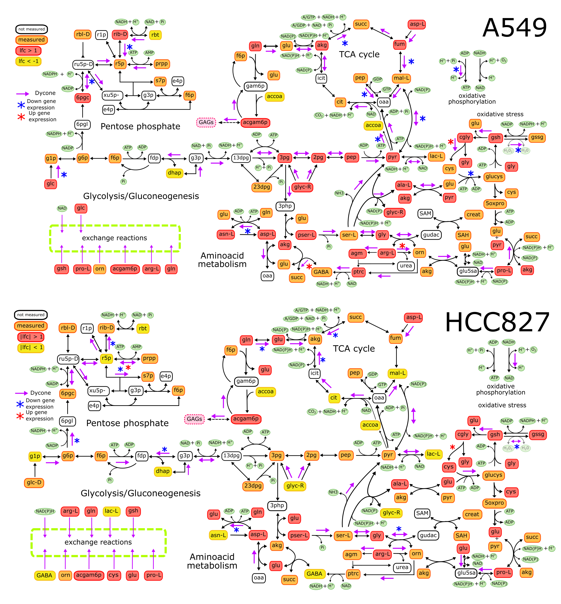

EMT analysis protocol
================

## Data

This is a protocol to analyze Metabolomic data from [Sun Y., *et. al.*
2014](https://doi.org/10.1186/2049-3002-2-20) to infer reactions
changing after EMT induction with TGF-\(\beta\). We analyzed the data
from the three cell lines: A549, HCC827, NCI-H358.

## Metabolomic analysis

The tables contain name, BIGG, HMDB, KEGG ids, and concentrations of
several metabolites measured in LC-MS and
    GC-MS.

``` r
head(A549)
```

    ##                       BIOCHEMICAL   KEGG      HMDB A549.Parental.1
    ## 1         1,2-dipalmitoylglycerol        HMDB07098            1.47
    ## 2                dihydroxyacetone C00184 HMDB01882            1.63
    ## 3         1,3-dipalmitoylglycerol                             0.92
    ## 4     1-arachidonoyl-GPE* (20:4)*        HMDB11517            1.15
    ## 5  1-docosahexaenoyl-GPC* (22:6)*                             1.34
    ## 6 1-docosapentaenoyl-GPC* (22:5)*                             1.89
    ##   A549.Parental.2 A549.Parental.3 A549.Parental.4 A549.Parental.5
    ## 1            1.11            1.10            1.62            1.14
    ## 2            1.24            1.20            0.91            0.70
    ## 3            1.36            1.15            0.47            0.61
    ## 4            1.62            1.45            1.02            1.16
    ## 5            1.29            2.27            0.72            0.66
    ## 6            2.25            2.75            0.85            0.86
    ##   A549.Mesenchymal.1 A549.Mesenchymal.2 A549.Mesenchymal.3 A549.Mesenchymal.4
    ## 1               0.91               0.81               0.78               0.80
    ## 2               1.11               1.02               0.92               0.87
    ## 3               0.13               0.90               0.37               0.13
    ## 4               5.41               3.92               3.57               4.49
    ## 5               0.24               0.24               0.24               0.24
    ## 6               0.11               0.11               0.11               1.27
    ##   A549.Mesenchymal.5
    ## 1               0.83
    ## 2               0.90
    ## 3               0.13
    ## 4               4.23
    ## 5               0.24
    ## 6               0.11

Hence, we calculated the fold change and compare using a paired t test.
We considered a significant value when *p*-value less than .05 and log
fold change absolute value above 1. The same process was done for the
three cell lines.

``` r
Parental<-grep("Parental",colnames(A549))
Mesenchymal<-grep("Mesenchymal",colnames(A549))

apply(A549[,Parental],1,mean)->concmetepi
apply(A549[,Mesenchymal],1,mean)->concmetmes


for(i in 1:length(rownames(A549))){
  t.test(as.numeric(A549[i,Parental]),as.numeric(A549[i,Mesenchymal]),paired = T)->test
  test$p.value->A549$pvalue[i]
}
p.adjust(A549$pvalue,method = "fdr")->A549$pvalue

A549$foldchange<-log2(concmetmes/concmetepi)

head(A549[,c(1,14:15)])
```

    ##                       BIOCHEMICAL      pvalue foldchange
    ## 1         1,2-dipalmitoylglycerol 0.029433444 -0.6409189
    ## 2                dihydroxyacetone 0.282684091 -0.2368578
    ## 3         1,3-dipalmitoylglycerol 0.014143646 -1.4419442
    ## 4     1-arachidonoyl-GPE* (20:4)* 0.009317236  1.7562227
    ## 5  1-docosahexaenoyl-GPC* (22:6)* 0.052602594 -2.3877302
    ## 6 1-docosapentaenoyl-GPC* (22:5)* 0.107457586 -2.3303403

And finally we got these
graphs:

<!-- --><!-- --><!-- -->

In summary, if we compare the three cell lines we got that, after EMT,
only 6 metabolites changed in common for all the NSCLC cell
    lines.

<!-- -->

    ## [1] "glycerol 3-phosphate (G3P)"        "glycerophosphorylcholine (GPC)"   
    ## [3] "glycyltyrosine"                    "N-acetylglucosamine 6-phosphate"  
    ## [5] "nicotinamide ribonucleotide (NMN)" "tryptophan"

## Dycone analysis

Then, we introduce the data to
[Dycone](https://github.com/cdiener/dycone) algorithm. In summary, this
algorithm will predict which reactions are changing among two
conditions, in this case before and after EMT, using the
[k-cone](https://github.com/cdiener/kcone-paper) approach.

We start with a reconstruction and the table of the metabolites with
KEGG and HMDB ids. Dycone has special functions to convert bidirectional
reactions in two irreversible reactions. As in original paper we imputed
missing data from [Human Metabolome
Database](https://hmdb.ca/metabolites) to complete the concentration
table. Then we applied k-cone analysis to predict which reactions are
changing after EMT. This same process was done for the three cell lines.

``` r
library(dycone)

r <- read_reactions("input/reactions.csv")
id_map <- read.csv("input/id_map_RXNS.csv", stringsAsFactors=FALSE)

metab <- read.csv("input/metabolomeA549.csv")

library(tidyr)
library(ggplot2)

#############################################
#Imputation of missing data

#### ID map must haveonly one HMDB id per metabolite

matches <- sapply(id_map$kegg, grep_id, x = metab$kegg_id)
miss <- is.na(matches)

full <- id_map[, 1:2]
d_idx <- 5:14
m <- matrix(NA, nrow = nrow(full), ncol = length(d_idx))
colnames(m) <- names(metab)[d_idx]
full <- cbind(full, m)
matched_idx <- !is.na(matches)
full[matched_idx, 3:12] <- metab[matches[matched_idx], d_idx]

{
  concs <- hmdb_concentration(id_map$hmdb, add = id_map[, 1:2])
} %c% "output/scraped_concs.Rd"


m_concs <- as.vector(by(concs, concs$name, priority_mean))
names(m_concs) <- levels(factor(concs$name))


scraped <- data.frame(kegg = names(m_concs), normal = m_concs)
rownames(scraped) <- NULL
patched <- patch(full, id = 1, normal = 3:7, treatment = 8:12, ref_data = scraped)
patched[is.na(patched)]<-1
head(patched)
```

    ##     name   kegg A549.Parental.1 A549.Parental.2 A549.Parental.3 A549.Parental.4
    ## 1  23dpg C01159            0.28            0.28            0.28            0.28
    ## 2    2pg C00631            0.35            0.14            0.93            0.04
    ## 3    3pg C00197            0.24            0.17            0.49            0.14
    ## 4  4abut C00334            0.43            0.71            0.78            0.87
    ## 5 5oxpro C01879            0.51            0.67            0.66            0.98
    ## 6   6pgc C00345            0.20            0.09            0.22            0.03
    ##   A549.Parental.5 A549.Mesenchymal.1 A549.Mesenchymal.2 A549.Mesenchymal.3
    ## 1            0.28               0.28               0.28               0.28
    ## 2            0.18               3.21              23.93               7.41
    ## 3            0.13               6.18              14.25              14.76
    ## 4            1.21               0.61               1.28               0.67
    ## 5            0.72               0.59               0.58               0.76
    ## 6            0.03               3.42               0.39               0.66
    ##   A549.Mesenchymal.4 A549.Mesenchymal.5
    ## 1               0.28               0.28
    ## 2              35.32               5.48
    ## 3              21.54              11.19
    ## 4               0.37               0.67
    ## 5               0.64               0.67
    ## 6               1.45               2.86

``` r
###########################################
####k-cone analysis
S <- stoichiometry(r)

mats <- ma_terms(S, patched[, c(1, 3:12)])

samples <- rep(c("normal", "disease"), each = 5)

h<-hyp(r,samples,mats,full=T)

pw <- rp(make_irreversible(r), "pathway")[,2]
r_ids <- rp(make_irreversible(r), "KEGG_reaction")[,2]

h$hyp <- cbind(h$hyp, pathway = pw[h$hyp$idx])
h$hyp <- cbind(h$hyp, reaction_id = r_ids[h$hyp$idx])

###Save all results
#write.csv(h$hyp, file = "A549reactions.csv", quote = F, row.names = F,sep="\t")

#Number of reactions with significannt changes after EMT 
length(which(h$hyp$corr_pval<.05 & abs(h$hyp$k_lfc)>1))
```

    ## [1] 70

``` r
FINAL<-h$hyp[which(h$hyp$corr_pval<.05 & abs(h$hyp$k_lfc)>1),]

write.csv(FINAL,file="output/DyconeA549.csv",quote=F,row.names=F)
```

In the following image we represented the reactions altered according to
dycone analysis, besides changes in the expression of genes coding these
metabolic enzymes. We represented the results of dycone analysis with
purple arrows over the reactions. Also, asteriks represent gene
expression alteration of the enzymes that catalyzes these reactions.



## Gene expression analysis

Dycone predicted some reactions change during EMT, however it is
difficult to know what biological level affect these reactions. Hence,
we analyzed the microarray data to observe how gene expression is
related to metabolic rewiring. Here we show how we analyzed this data.

First these are the packages needed for the analysis:

We did the analysis for each one of the cell lines, here is one example:

``` r
sample_info <- read.table("input/ge_samplesA549.csv",header=T)
dir.create("ma")

already_there <- dir.exists(paste0("ma/", as.character(sample_info$geoID)))
file_info <- lapply(sample_info$geoID[!already_there], getGEOSuppFiles, baseDir="ma")

#### Download cel files
celfiles <- list.files("ma", pattern="*.cel*", recursive=T, ignore.case=T)
names(celfiles) <- sapply(celfiles, dirname)
condition <- rep(c("Parental","EMT"),each=3)
condition <- factor(condition)

raw_data <- ReadAffy(filenames = paste0("ma/", celfiles[sample_info$geoID]),compress=T)
pData(raw_data)$cell_line <- sample_info$cell_line
pData(raw_data)$condition <- condition

#### Noramlize data
eset <- frma(raw_data)
save(eset, file="output/ExpressionSetA549.Rd")


mean_max <- findLargest(rownames(eset), rowMeans(exprs(eset)))
gset <- eset[mean_max, ]
rownames(gset) <- as.character(hgu133plus2ENTREZID)[mean_max]


#### Differential expression analysis

design <- model.matrix(~ 0 + condition)
colnames(design) <- levels(condition)
fit <- lmFit(gset, design)
contrast.matrix <- makeContrasts(EMT - Parental, levels=design)
cfit <- contrasts.fit(fit, contrast.matrix)
ebfit <- eBayes(cfit)

ma_lfcs <- topTable(ebfit, number=Inf)
save(ma_lfcs, file="output/gene_expressionA549.Rd")
head(ma_lfcs)
```

    ##            logFC  AveExpr          t      P.Value    adj.P.Val        B
    ## 3624    7.905903 8.378676  166.54978 5.074025e-15 1.042509e-10 23.44502
    ## 3248   -5.286562 7.040191 -106.24046 1.636261e-13 1.035736e-09 21.34783
    ## 196051  4.999805 6.680181  105.56926 1.718356e-13 1.035736e-09 21.31218
    ## 79413   5.046897 6.826946   99.04615 2.812304e-13 1.035736e-09 20.94458
    ## 4325    4.533497 5.820791   96.37256 3.474147e-13 1.035736e-09 20.78207
    ## 56034   4.132161 9.255216   93.85869 4.260889e-13 1.035736e-09 20.62245

The three data sets were analyzed in parallel, getting the differental
expression for each
    one.

HCC827:

    ##           logFC  AveExpr         t      P.Value    adj.P.Val        B
    ## 163782 7.354809 7.431979 106.87195 6.175800e-14 1.268880e-09 21.50227
    ## 57685  5.275845 7.681816  89.88281 2.472713e-13 2.540218e-09 20.63214
    ## 54947  5.735411 7.425573  79.46871 6.631428e-13 3.517106e-09 19.93435
    ## 9839   4.588317 5.310706  76.78824 8.728964e-13 3.517106e-09 19.72882
    ## 7474   5.501109 7.593703  74.14273 1.155869e-12 3.517106e-09 19.51402
    ## 1281   8.349521 8.184873  74.13333 1.157044e-12 3.517106e-09 19.51323

NCI-H358:

    ##            logFC  AveExpr          t      P.Value    adj.P.Val        B
    ## 54845  -6.511707 7.509868 -111.76903 2.624379e-14 5.392049e-10 22.82897
    ## 6286   -6.048253 8.735478  -93.74414 1.103607e-13 6.484846e-10 21.79486
    ## 10974  -4.616219 7.568232  -87.48246 1.940759e-13 6.484846e-10 21.35399
    ## 114569 -5.044326 9.535328  -86.87290 2.054783e-13 6.484846e-10 21.30838
    ## 26298  -4.780949 6.373925  -83.95460 2.715995e-13 6.484846e-10 21.08290
    ## 55584   4.018300 6.073121   83.11071 2.949512e-13 6.484846e-10 21.01542

Now we look for those genes with different expression that are involved
in our predicted reactions.

``` r
library(AnnotationDbi, quietly=TRUE, warn.conflicts=F)
library(dplyr, quietly=TRUE, warn.conflicts=F)
library(hgu133plus2.db)
```

``` r
ecs <- rp(make_irreversible(r), "KEGG_enzyme")
ens <- AnnotationDbi::select(hgu133plus2.db, keys = unique(ecs[, 2]), 
                             keytype = "ENZYME", columns = c("SYMBOL", "ENSEMBL", "ENTREZID"))
```

    ## 'select()' returned 1:many mapping between keys and columns

``` r
load("output/gene_expressionA549.Rd")
info <- ecs %>% group_by(r_idx) %>% do(ens[ens$ENZYME %in% .$KEGG_enzyme,])

good <- sapply(info$ENTREZID, function(eid) !is.na(eid) & (eid %in% rownames(ma_lfcs)))
cat(sprintf("%f%% of enzymes found on array.\n", sum(good)/length(good)*100))
```

    ## 88.020833% of enzymes found on array.

``` r
info <- info[good, ]

info <- info %>% group_by(r_idx) %>% mutate(met_lfc=h$hyp$k_lfc[h$hyp$idx %in% r_idx], met_pval=h$hyp$corr_pval[h$hyp$idx %in% r_idx], pathway=h$hyp$pathway[h$hyp$idx %in% r_idx])

get_ma_lfc <- function(eid) {
    found <- which(eid[1] == rownames(ma_lfcs))

    return(data.frame(ge_lfc = ma_lfcs$logFC[found],
        ge_pval = ma_lfcs$adj.P.Val[found]))
}

ge <- lapply(info$ENTREZID, get_ma_lfc)
info <- bind_cols(info, do.call(rbind, ge))

info$significant <- info$ge_pval<0.05 & info$met_pval<0.05

info[info$significant, ]
```

    ## # A tibble: 77 x 11
    ## # Groups:   r_idx [31]
    ##    r_idx ENZYME SYMBOL ENSEMBL ENTREZID met_lfc met_pval pathway ge_lfc ge_pval
    ##    <int> <chr>  <chr>  <chr>   <chr>      <dbl>    <dbl> <fct>    <dbl>   <dbl>
    ##  1     4 4.2.1… ENO1   ENSG00… 2023       5.35   2.21e-2 Glycol… -0.685 1.13e-5
    ##  2     4 4.2.1… ENO2   ENSG00… 2026       5.35   2.21e-2 Glycol… -0.675 7.67e-5
    ##  3     5 4.2.1… ENO1   ENSG00… 2023       6.14   3.04e-3 Glycol… -0.685 1.13e-5
    ##  4     5 4.2.1… ENO2   ENSG00… 2026       6.14   3.04e-3 Glycol… -0.675 7.67e-5
    ##  5    18 5.4.2… PGM1   ENSG00… 5236      -1.89   2.77e-2 Glycol… -0.241 4.87e-3
    ##  6    33 2.7.6… PRPS2  ENSG00… 5634      -3.42   1.40e-2 Pentos… -0.452 9.11e-4
    ##  7    44 4.2.1… ACO1   ENSG00… 48        -0.782  2.73e-2 TCA cy…  0.412 2.25e-4
    ##  8    44 4.2.1… ACO2   ENSG00… 50        -0.782  2.73e-2 TCA cy… -0.305 3.35e-3
    ##  9    46 2.3.3… CS     ENSG00… 1431      -2.57   8.57e-5 TCA cy… -0.311 9.15e-4
    ## 10    46 1.2.4… PDHA1  ENSG00… 5160      -2.57   8.57e-5 TCA cy… -0.384 3.03e-4
    ## # … with 67 more rows, and 1 more variable: significant <lgl>

``` r
write.csv(info[info$significant,], "output/Gene-ReactionsA549.csv")
```

HCC827:

    ## # A tibble: 76 x 11
    ## # Groups:   r_idx [32]
    ##    r_idx ENZYME SYMBOL ENSEMBL ENTREZID met_lfc met_pval pathway ge_lfc ge_pval
    ##    <int> <chr>  <chr>  <chr>   <chr>      <dbl>    <dbl> <fct>    <dbl>   <dbl>
    ##  1     4 4.2.1… ENO1   ENSG00… 2023        5.35  0.0221  Glycol… -0.363 1.56e-3
    ##  2     4 4.2.1… ENO2   ENSG00… 2026        5.35  0.0221  Glycol…  0.228 1.11e-2
    ##  3     4 4.2.1… ENO3   ENSG00… 2027        5.35  0.0221  Glycol…  0.396 7.10e-4
    ##  4     5 4.2.1… ENO1   ENSG00… 2023        6.14  0.00304 Glycol… -0.363 1.56e-3
    ##  5     5 4.2.1… ENO2   ENSG00… 2026        6.14  0.00304 Glycol…  0.228 1.11e-2
    ##  6     5 4.2.1… ENO3   ENSG00… 2027        6.14  0.00304 Glycol…  0.396 7.10e-4
    ##  7    14 2.7.2… PGK1   ENSG00… 5230        4.90  0.0167  Glycol… -0.253 1.04e-2
    ##  8    15 2.7.2… PGK1   ENSG00… 5230       -3.30  0.00304 Glycol… -0.253 1.04e-2
    ##  9    18 5.4.2… PGM2   ENSG00… 55276      -1.89  0.0277  Glycol… -0.751 3.83e-5
    ## 10    33 2.7.6… PRPS1  ENSG00… 5631       -3.42  0.0140  Pentos…  1.12  3.06e-4
    ## # … with 66 more rows, and 1 more variable: significant <lgl>

NCI-H358:

    ## # A tibble: 76 x 11
    ## # Groups:   r_idx [33]
    ##    r_idx ENZYME SYMBOL ENSEMBL ENTREZID met_lfc met_pval pathway ge_lfc ge_pval
    ##    <int> <chr>  <chr>  <chr>   <chr>      <dbl>    <dbl> <fct>    <dbl>   <dbl>
    ##  1     4 4.2.1… ENO1   ENSG00… 2023        5.35  2.21e-2 Glycol… -0.193 1.06e-2
    ##  2     4 4.2.1… ENO2   ENSG00… 2026        5.35  2.21e-2 Glycol… -0.307 7.04e-3
    ##  3     4 4.2.1… ENO3   ENSG00… 2027        5.35  2.21e-2 Glycol…  0.312 9.14e-3
    ##  4     5 4.2.1… ENO1   ENSG00… 2023        6.14  3.04e-3 Glycol… -0.193 1.06e-2
    ##  5     5 4.2.1… ENO2   ENSG00… 2026        6.14  3.04e-3 Glycol… -0.307 7.04e-3
    ##  6     5 4.2.1… ENO3   ENSG00… 2027        6.14  3.04e-3 Glycol…  0.312 9.14e-3
    ##  7    18 5.4.2… PGM2   ENSG00… 55276      -1.89  2.77e-2 Glycol… -0.601 8.13e-5
    ##  8    33 2.7.6… PRPS1  ENSG00… 5631       -3.42  1.40e-2 Pentos…  0.595 3.03e-5
    ##  9    33 2.7.6… PRPS2  ENSG00… 5634       -3.42  1.40e-2 Pentos… -0.421 3.51e-4
    ## 10    46 1.2.4… PDHB   ENSG00… 5162       -2.57  8.57e-5 TCA cy… -0.238 3.21e-3
    ## # … with 66 more rows, and 1 more variable: significant <lgl>
